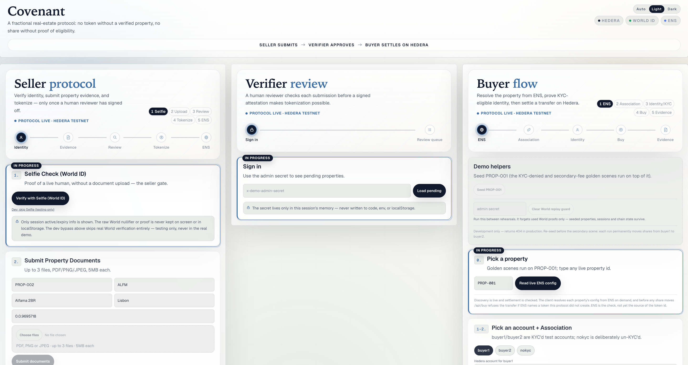
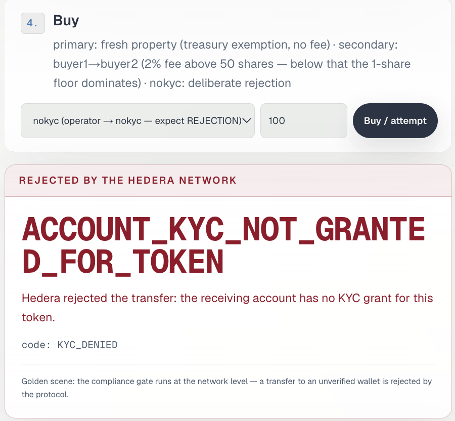
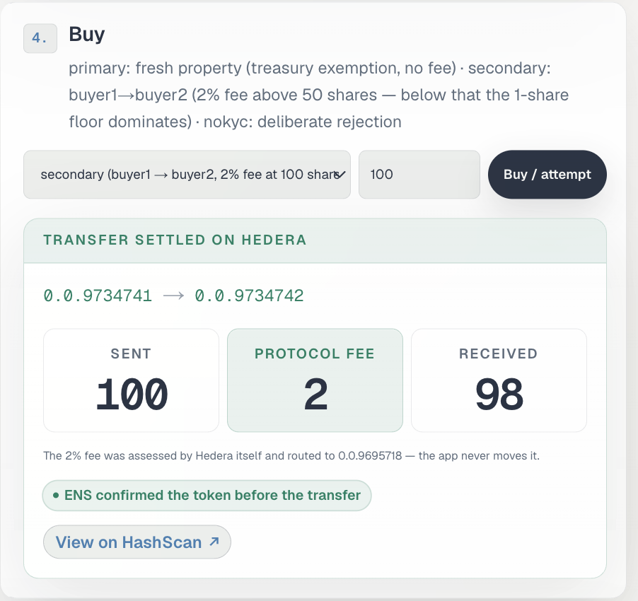
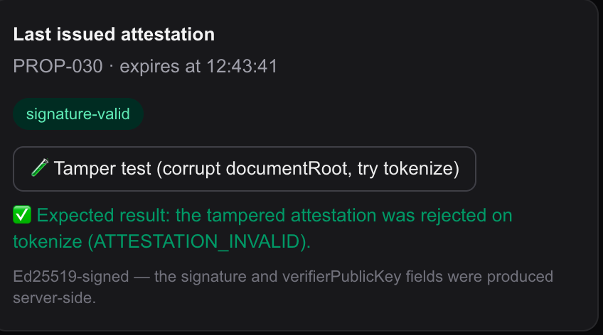

# PPREV

**Privacy-Preserving Real Estate Verification** · ETHGlobal Lisbon 2026

A protocol for renting and selling real estate in which no transaction can move forward until
property ownership has been verified and counterparty eligibility has been proven — and in
which identity, verification, and compliance decisions are written on-chain without leaking
personal data. One core, two modes: **sale** (fractional shares) and **rental** (escrowed
deposit).

> 🚧 Hackathon in progress. This README is split into two halves — to avoid conflicts, each of
> us writes only in our own half.

---

<!-- ═══════════ TOP HALF — AKIF ═══════════ -->
<!-- pitch · screenshots · how it works · track table -->

## Pitch

Fractional real-estate platforms ask you to trust two things you cannot check: that the
property is real and belongs to the person selling it, and that the people you are trading
with are allowed to be there. The usual answer is a company that has verified everyone and
promises it did — and a database of passport scans waiting for a breach.

PPREV replaces both promises with checks that hold without us.

A property cannot be tokenized until a human reviewer signs an attestation over its
documents; change one character and the mint refuses. A buyer cannot receive shares until
they have proven eligibility — and once they have, the refusal for anyone who hasn't comes
from **Hedera itself**, not from our code. Take this server offline and that rule still
holds.

Nobody hands over a passport to make that work. World ID proves a live human is present
and that an eligibility predicate is true; the app receives the *result*, never the
underlying facts. We could not produce a buyer's name or date of birth if we were compelled
to, because we never received one.

## Screenshots

The demo runs as three columns on one screen — Seller, Verifier, Buyer — because the whole
argument is that these are three different parties with three different amounts of trust.



**Hedera refuses the transfer, not us.** Buying with the deliberately un-KYC'd account fails
at the network level. `code` is ours; `ACCOUNT_KYC_NOT_GRANTED_FOR_TOKEN` is Hedera's.



**The fee belongs to the token.** A secondary transfer debits the sender 100, the network
takes 2 against an immutable fee schedule, and the recipient receives 98. Sent and received
are shown separately because quoting one number for both would contradict Mirror Node's own
transfer list for the same transaction.



**An attestation is only worth its signature.** Corrupt one field of an approved attestation
and tokenization refuses it.



## How it works

Four gates, in order. Each one is enforced by something outside this application.

**1. A live human, or no listing.** The seller passes World ID's Selfie Check
(`onboard-seller`) before they can upload anything. This does not prove they own the
property — it prevents one actor from farming forty plausible listings. The app receives a
proof of humanity and an opaque session token; the nullifier never reaches the browser.

**2. A signed attestation, or no token.** Documents go to a human verifier, who reviews them
and signs an Ed25519 attestation binding `{propertyId, seller, documentRoot, expiry}`.
`/api/tokenize` accepts nothing else. The document bytes never leave the server — only a
Merkle root and a count are published to Hedera's audit topic.

**3. Proven eligibility, or no shares.** The buyer passes Identity Check (`verify-buyer`),
which asserts age and jurisdiction and discloses neither. On success the server grants
Hedera KYC on the property token. From that moment the permission is enforced at the network
level: a transfer to an account without a grant fails with
`ACCOUNT_KYC_NOT_GRANTED_FOR_TOKEN`, returned by consensus nodes, not by an `if` statement
in our route handler.

**4. Config that isn't ours to lie about.** Before the buyer flow shows anything, it resolves
the property's configuration — token id, audit topic, verifier public key, policy hash —
from that property's ENS subname on Sepolia. A client learns which token a property uses by
asking ENS, not by trusting our response.

Settlement carries the protocol's economics with it: a secondary transfer of 100 shares
debits the sender 100, the network takes 2 as a fractional fee, and the recipient receives
98. The fee is assessed by Hedera against the token's own fee schedule — the application
never moves it, and the fee schedule is immutable.

The same four gates run in rental mode, where the settlement is an HBAR escrow release
instead of a share transfer. One core, two modes.

## Track table

| Track | What we built | Where to check it |
|---|---|---|
| **Hedera** | HTS token with a KYC key and an immutable 2% fractional fee; HCS append-only audit topic; Mirror Node as the read path for everything the UI claims. No Solidity — every operation is a native SDK transaction. | [`docs/EVIDENCE.md`](docs/EVIDENCE.md) · `npm run e2e:sale` |
| **World** | World ID 4.0 with three separate actions (`onboard-seller`, `verify-buyer`, `verify-tenant`) so one person can be a seller, a buyer and a tenant without burning a nullifier. Proofs are re-verified server-side; `success: true` from the client is never trusted. | [`docs/FEEDBACK_selfie.md`](docs/FEEDBACK_selfie.md) · [`docs/FEEDBACK_identity.md`](docs/FEEDBACK_identity.md) |
| **ENS** | Per-property subnames on the ENSv2 alpha carrying protocol config as text records, written programmatically and resolved live from Sepolia on demand. **ENS is checked before every share transfer and can refuse one:** a record naming a token this protocol did not create returns `ENS_CONFIG_MISMATCH` and nothing moves. A stale record does not block, and neither does an unreachable resolver — only a substituted one. | `npm run test:ens-guard` (4/4, live records) · `npm run ens:write` · the ENS panel in the Buyer column |

<!-- ═══════════ END OF TOP HALF ═══════════ -->

---

<!-- ═══════════ BOTTOM HALF — RECEP ═══════════ -->
<!-- architecture · No Solidity · setup · verifier boundary · public/private table · ENS · evidence · AI usage -->

## Architecture

One core, two transaction modes. Every integration does one natural job — nothing is
glued on for a prize category:

| Layer | Technology | Role |
|---|---|---|
| Humanity / identity | **World ID 4.0** (Selfie + Identity Check) | Seller/landlord abuse prevention; buyer/tenant eligibility — ZK-based, no personal data disclosed |
| Asset & settlement | **Hedera HTS** | Fractional property token (1000 shares, `decimals=0`), KYC-gated transfers, 2% fractional fee |
| Escrow (rental) | **Hedera HBAR transfers** | Deposit lock, clean-refund settlement, permissionless expiry with a 10% landlord slash |
| Audit trail | **Hedera HCS** | Append-only public event log; today's payloads carry digests and ids only, no personal data |
| Public verification | **Hedera Mirror Node** | The timeline the UI shows is read back from public data, not from our own store |
| Ownership trust | **Minimal verifier** (Ed25519) | Human review → signed attestation; tokenization is impossible without it |
| Discovery | **ENS** (Sepolia, v2 + UniversalResolver) | Per-property protocol config resolved live — no token id, topic id or verifier key is hard-coded |

Two caveats on the HCS log, both checkable from outside. **It is append-only, not
immutable.** A message that reached consensus cannot be edited or removed, but the topic
(`0.0.9734777`) was created with an admin key, so the operator can still delete the topic
itself, and with **no submit key**, so anyone at all can publish to it. The defence is on
the read side: `lib/hedera/mirror.ts` keeps only messages whose `payer_account_id` is our
operator and drops the rest, so a stranger cannot inject a well-formed `RENTAL_SETTLED`
into the timeline. Nothing is concealed by that filter — the messages stay public, and
anyone can apply the same rule to the same topic and reach the same list.

**Payloads carry no personal data going forward, and the past is still there.**
`/api/attest` now publishes a document root and a count, nothing else. But the payload
guard matches key *names*, not values, so 39 early `PROPERTY_SUBMITTED` messages
(sequence 2 to 189) permanently contain a `city` field. That topic is linked from
[`docs/EVIDENCE.md`](docs/EVIDENCE.md) and those messages are not coming off it. A log
that still shows our own mistake is the honest form of this claim.

Both modes share the same three phases — **Register → Apply/Engage → Settle** — and the
same verifier/World/ENS infrastructure. Only the predicate and the settlement differ:
a sale ends in a KYC-gated share transfer; a rental ends in an escrow release (with or
without a penalty). That is the concrete form of the claim that the protocol is
domain-agnostic.

The strongest single moment: a transfer to an account **without a KYC grant** fails with
`ACCOUNT_KYC_NOT_GRANTED_FOR_TOKEN` — issued by the **Hedera network itself**, not by our
application code. Take this server offline and the rule still holds.

## No Solidity

Zero. No `.sol` files, no hardhat/foundry/ethers, no EVM deploy step — verify with
`find . -name "*.sol" -not -path "./node_modules/*"`. Every on-chain operation is a
native Hedera SDK transaction (`TokenCreateTransaction`, `TokenGrantKycTransaction`,
`TransferTransaction`, `TopicCreateTransaction`, `TopicMessageSubmitTransaction`).
`viem` appears only to read and write ENS records on Sepolia. (`@ensdomains/ensjs` is still in
`package.json` from the abandoned v1 registration path and is imported by nothing — a leftover,
not a dependency of the working code.)

## Setup

**Steps 1–7 need nothing from us** — a free funded Hedera testnet account from
`portal.hedera.com` is enough, and they reproduce every Hedera claim in this README,
including all three golden scenes. The last two need credentials we cannot hand over; see
*Running the full demo yourself* below.

```bash
npm install
cp .env.example .env.local
# Fill in OPERATOR_ID / OPERATOR_KEY, plus NULLIFIER_HMAC_SECRET and DEMO_ADMIN_SECRET
# (any random strings). Leave AUDIT_TOPIC_ID and SEED_TOKEN_ID EMPTY — bootstrap treats a
# non-empty value as "already done" and will report success without opening a topic.
npm run verifier:keygen        # prints VERIFIER_PRIVATE_KEY / VERIFIER_PUBLIC_KEY to paste
npm run smoke                  # operator alive, key parses, balance sufficient
npm run accounts:create        # ONE TIME — creates buyer1 / buyer2 / nokyc into .env.local.
                               # Re-running creates three NEW accounts, strands the old ones
                               # and loses their KYC grants. There is no guard.
npm run bootstrap              # opens the HCS audit topic
npm run golden                 # ONE TIME — mints the seed token and verifies the three
                               # golden moments. Re-running mints a NEW token: restart the
                               # dev server and re-run ens:write afterwards.
npm run dev                    # http://localhost:3000
```

Without World credentials, run `npm run dev:noworld` instead: proofs are accepted without
verification and every acceptance is logged loudly. A production build does not refuse to
start without World credentials — it starts and reports itself as `dev-fallback` on
`/api/health`; what it refuses is to accept an unverified proof, which is the check that
matters. This is the fastest path to seeing the flow work.

### Running the full demo yourself

Two things need accounts that cannot be shared, and this section exists because leaving them
at their defaults fails in a way that looks like a bug in the code:

- **ENS.** `ENS_PARENT_NAME` defaults to our name, `pprevlisbon.eth`. You cannot write to it —
  `npm run ens:write` will revert. Worse, ENS *reads* are permissionless, so your server will
  happily resolve **our** records, and the ENS consistency check will then see a token whose
  treasury is not your operator and refuse every sale with `ENS_CONFIG_MISMATCH`. That is the
  guard working correctly on a misconfiguration. Register your own Sepolia name with
  `npm run ens:register` (needs a funded Sepolia wallet in `ENS_PRIVATE_KEY`), point
  `ENS_PARENT_NAME` at it, then `npm run ens:write`.
- **World ID.** Register an app at `developer.world.org` with three incognito actions —
  `onboard-seller`, `verify-buyer`, `verify-tenant` — and fill in the three values. Ours is a
  staging registration, which is why verification runs against the World Simulator rather than
  a phone.

Then seed before any rehearsal — it registers PROP-001 (sale showcase) and PROP-003
(rental), tops buyer1 back up by recycling shares from buyer2 rather than draining the
treasury, and re-associates nokyc **without** granting it KYC. It also re-prepares every
other tokenized property, so a token minted during a live run is demo-ready too.

```bash
export SECRET=$(grep '^DEMO_ADMIN_SECRET=' .env.local | cut -d= -f2)
curl -s -X POST localhost:3000/api/seed -H "x-demo-admin-secret: $SECRET"
```

`.env.local` is read by Next and by `tsx`, not by your shell, so the secret has to be
exported explicitly — a request with an empty header answers `401 UNAUTHORIZED`.

Preflight runs **last**, not first: it fails hard if the server is unreachable or if
fewer than two properties are seeded, so it can only pass once `npm run dev` and the seed
above have run.

```bash
npm run preflight              # one-shot stage-readiness check (read-only, free)
```

It exits non-zero on any failure. Exit 0 comes in two forms — `✅ All green. Go.` and
`⚠️ Green with N warning(s)` — and the second still means read the warnings before going
on stage. It verifies every scene precondition from public data, including the
deliberately-unKYC'd account and whether the prop-001 ENS record still matches
`SEED_TOKEN_ID` (that drifts every time `npm run golden` re-mints the seed token). Crisis
procedures live in [`docs/RUNBOOK.md`](docs/RUNBOOK.md).

Seed and reset require the admin secret: a `POST` with no custom header is a CORS simple
request, so without it any page on any machine that can reach this server could wipe the
demo mid-run.

Test suite (all against real testnet, all assert in code):

```bash
# No server, no network:
npm run merkle             # commitment scheme property tests
npm run tamper             # doctored attestations blocked (6 cases) — needs VERIFIER_* keys
npm run test:idem          # the buy replay guard suppresses a double click and nothing else

# Need `npm run dev` running, and DEMO_ADMIN_SECRET set:
npm run test:ens-guard     # all four ENS verdicts, against the live records
npm run e2e:sale           # full sale flow over HTTP, real token minted
npm run e2e:rental         # escrow lock/settle/expire, balances read from a consensus node
```

> `e2e:sale` and `e2e:rental` **`POST /api/reset` first** — running one mid-rehearsal wipes
> the seeded store. Use `npm run e2e:sale:safe` / `npm run e2e:rental:safe` to leave it intact.

## The minimal verifier boundary

Stated plainly, because it is the most important honest sentence in this project:
**this MVP proves the integrity and the timestamp of a document; it does not prove the
document came from the land registry.**

What the verifier gate does enforce — a human reviews the documents, and approval is an
Ed25519 signature over a fixed canonical payload binding `{propertyId, seller, document
root, expiry}` together. `/api/tokenize` refuses anything else: change one character of
an attestation and the mint never happens (`npm run tamper` demonstrates all six ways).

What it deliberately does not do — document **provenance**. That layer requires
TLSNotary/zkTLS against the registry's web service plus a ZK circuit proving predicates
over the transcript; the architecture reserves its place and it is the core post-hackathon
work. The verifier is also a single human here; production expands this to a multi-notary
threshold signature.

## Public / private data table

| Data | Where it lives | Ever on-chain / in a response? |
|---|---|---|
| Document bytes | Server memory only | **Never** |
| Document salts | Server memory only | **Never** |
| Merkle root + document count | HCS | Yes — that is the point |
| Raw World nullifier | Nowhere (HMAC digest only) | **Never** |
| World proof | Verified server-side, then dropped | **Never** |
| Buyer/tenant name, DOB, income figure | Never collected | **Never** |
| Eligibility predicate *result* (booleans) | HCS | Yes |
| Seller session token | `randomBytes(32)`, 30 min TTL (`SELLER_SESSION_TTL_MINUTES`) | Returned once; unrelated to World data |
| Token ids, tx ids, account ids | HCS / Mirror / ENS | Yes — public by design |
| All private keys & secrets | Server env only | **Never** (frontend machine gets a URL, not keys) |

`assertNoSensitiveKeys()` walks every payload before it is submitted and throws on any key
whose *name* matches nullifier/proof/salt/income/etc. That is a naming discipline, not
enforcement: it reads names, never values, so both leaks that actually mattered went
straight past it and had to be removed by hand — the seller-typed `city` in
`PROPERTY_SUBMITTED` (`app/api/attest/route.ts`), and the verifier's free-text rejection
reason, which is now published as a length plus a SHA-256 digest instead
(`app/api/verifier/decision/route.ts`). The guard itself has fired twice, both times on a
field name containing "income", and both times the effect was that the audit event was
silently dropped rather than the leak blocked — the chain operation it described had
already happened, so the write was abandoned and the trail got a hole in it. That is why
the drop is now counted, exposed on `/api/health`, and `npm run preflight` fails on it.

## ENS config discovery

No token id, topic id or verifier key is hard-coded in this application's source. Each
property has a subname whose text records carry its protocol config, and the buyer flow
resolves them live from Sepolia before it will show you anything:

```
prop-002.pprevlisbon.eth          (values are illustrative — the token id
  com.pprev.mode                     SALE          changes on every mint, see below)
  com.pprev.hedera.propertyTokenId   0.0.97xxxxx
  com.pprev.hedera.auditTopicId      0.0.9734777
  com.pprev.verifier.publicKey       302a3005...
  com.pprev.policy.hash / .version   0x0597... / 1
```

**What this is and is not.** Discovery is genuinely live: `/api/ens-read` resolves these
records from Sepolia, `/api/tokenize` publishes each newly minted token id back to ENS,
and a client learns which token a property uses by asking Sepolia rather than by trusting
us. Resolution sits behind a 60-second in-memory cache (8 seconds when the answer is an
env fallback, so a degraded response cannot outlive the outage), and `/api/tokenize` drops
the cached entry as it writes — a freshly minted token id resolves immediately rather than
up to a minute later. ENS is also **checked at settlement**, which is the part worth being precise about.
`/api/buy` resolves the property's `propertyTokenId` before any share moves and refuses the
transfer — `ENS_CONFIG_MISMATCH`, nothing moved — if the record names a token this protocol
did not create. Repointing a record is therefore not cosmetic: it can stop a sale. Deleting one is not the
same thing — a missing record is indistinguishable from an outage, and outages deliberately do
not block.

What ENS does *not* yet do is **supply** the token id; that still comes from the server's own
record, with ENS as the check on it. Source rather than check is the honest next step.

The rule is asymmetric on purpose, and the asymmetry is where the thinking is. A record that
is merely behind does not block — `/api/tokenize` republishes in the background, so a buy
seconds after a mint legitimately still sees the previous token, and refusing there would kill
a real sale rather than an attack. Neither does an unreachable resolver: giving a Sepolia
outage the power to stop a Hedera transfer is worse than the substitution it would prevent.
Only a record naming a token whose treasury is not ours blocks, because that is the only case
that is someone else's doing — and "ours" is decided by Hedera, not by anything we store, since
a store that was reset does not remember the token it minted last week. `npm run test:ens-guard`
drives all four outcomes against the live records, because every safe path returns "proceed"
and a bug making the blocking branch unreachable would look exactly like a working check.

Rental properties carry a different field set (`com.pprev.rental.escrowAccount`,
`.reqDeposit` — and no token, deliberately); clients branch on `com.pprev.mode`.
`/api/ens-read` validates a different required-field set per mode.

Implementation notes worth knowing:

- Records are written **programmatically** (`npm run ens:write`) — one multicall per
  property, no UI involved. The name lives on the **ENSv2 alpha**; the v2
  UniversalResolver makes it readable from plain viem, and the parent's permissioned
  resolver accepts writes for subname nodes directly, so **no subname registration
  transactions exist at all**.
- Because the alpha deployment may reset state, resolution degrades honestly: on RPC or
  deployment failure the response switches to `source: "env-fallback"` instead of taking
  the demo down — and says so, rather than pretending it resolved.

## Evidence

Every claim above links to a permanent, independently verifiable artefact — real testnet
transactions and the accounts, token and topic they belong to, not screenshots:
[`docs/EVIDENCE.md`](docs/EVIDENCE.md)

## AI Usage

Backend, chain integrations, and test harnesses were built by Recep pair-programming with
Claude (Anthropic) in Claude Code; the frontend was built by Akif with AI assistance.
Everything the AI produced was executed and verified against real networks before being
committed — the test suite above asserts every headline claim in code, and several bugs
the AI's own tests caught (a silently dropped HCS event, a missing route the frontend was
already calling, a workspace-root misconfiguration serving the wrong project) are
documented in the commit history rather than smoothed over.

<!-- ═══════════ END OF BOTTOM HALF ═══════════ -->

---

## Documents

| File | Contents | Owner |
|---|---|---|
| [`docs/API.md`](docs/API.md) | API contract — the single source of truth | Recep |
| [`docs/EVIDENCE.md`](docs/EVIDENCE.md) | Live on-chain evidence links | Recep |
| [`docs/SUBMISSION.md`](docs/SUBMISSION.md) | ETHGlobal submission text | Akif |
| [`docs/FEEDBACK_selfie.md`](docs/FEEDBACK_selfie.md) | World Selfie Check feedback | Akif (user) + Recep (developer) |
| [`docs/FEEDBACK_identity.md`](docs/FEEDBACK_identity.md) | World Identity Check feedback | Akif (user) + Recep (developer) |
| [`docs/FEEDBACK_ens.md`](docs/FEEDBACK_ens.md) | ENS v2 alpha feedback — subnames that resolve without registration, and v1-registry invisibility | Recep |
| [`docs/RUNBOOK.md`](docs/RUNBOOK.md) | Stage ritual, ranked mid-demo failures, and the presenter rules found by walking the flows | Recep |

## Directory ownership

To keep parallel development conflict-free:

- **Recep:** `app/api/**`, `lib/hedera/**`, `lib/world/**`, `lib/verifier/**`, `lib/crypto/**`, `lib/store.ts`, `lib/ens/**`, `scripts/**`
- **Akif:** `app/components/**`, `app/views/**`, `app/globals.css`, `lib/mockApi.ts`, `lib/realApi.ts`
- **Shared (announce before touching):** `app/page.tsx`, `docs/API.md`, `README.md`, `package*.json`, `.env.example`

## No Solidity

Every on-chain operation runs through the native Hedera SDK — HTS (tokens), HCS (audit),
Mirror Node (public verification). The repository contains no `.sol` files and no EVM deploy
step.
